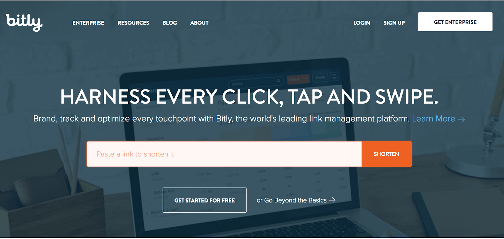
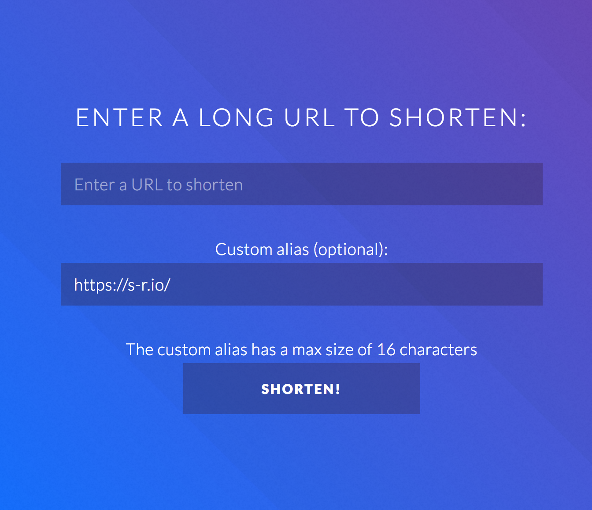
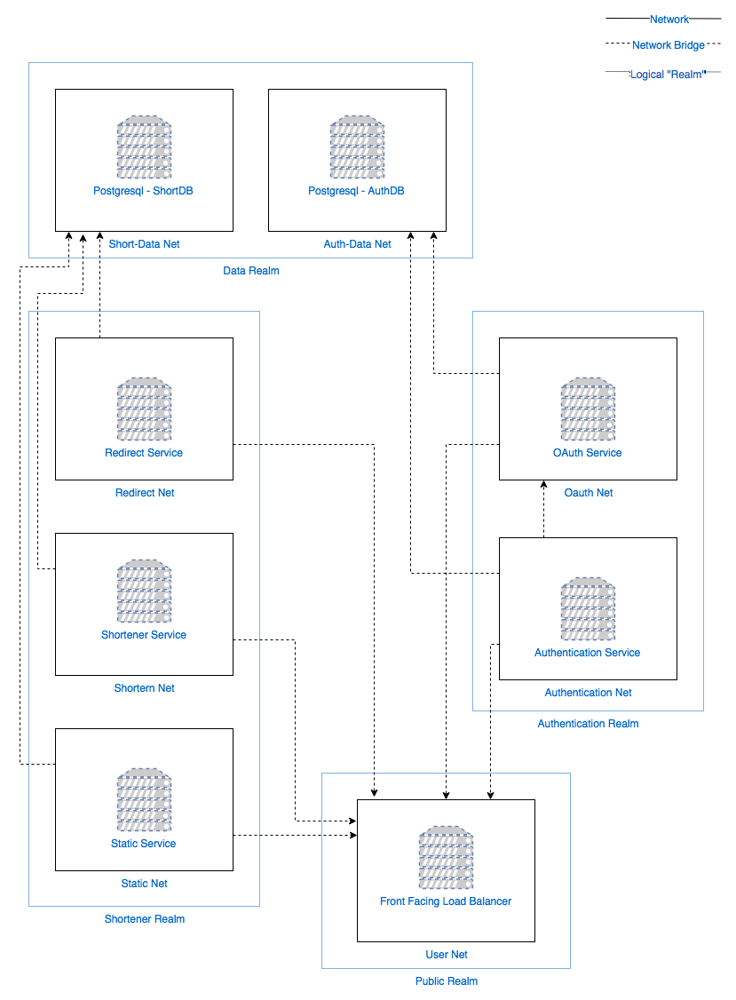

# **Software Requirements Specification** : Mangler

Mangler - Solomon Rubin

----

 <h1> Mangler / Manglr </h1>

<h2>Software Requirements Specification</h2>

<h3> Version: 0.0.1-Dev</h3>

> <h3>Solomon Rubin</h3> <h4>Lead Software Engineer<h4>

----

## **Revision History**

| Date | Description    | Author | Comments |
| ---- | -------------- | -------- | ------------- |
| 1.24.18 | On Going initial document development | Solomon Rubin | N/A           |
| 8.1.18 | Add Docker requirements | Solomon Rubin | N/A           |

## **Document Approval**

The following Software Requirements Specification has been accepted and approved by the following:

| Signature | Printed Name | Title | Date |
| --------- | ------------ | ----- | ---- |
| ...       | Solomon Rubin | Working Document Approval    |  4.10.18   |

**Acknowledgements:**

Sections of this document are based upon the IEEE Guide to Software Requirements Specification (ANSI/IEEE Std. 830-1984).  The SRS document was designed by Dr. Orest Pilskalns (WSU, Vancover) and Jack Hagemeister (WSU, Pullman).

----

**Table of Contents**
<!-- generated with markdown-toc -->

<!-- toc -->

* [1. **Introduction**](#1-introduction)
  * [1.1 **Purpose**](#11-purpose)
  * [1.2 **Scope**](#12-scope)
  * [1.3 **Definitions, Acronyms, and Abbreviations**](#13-definitions-acronyms-and-abbreviations)
  * [1.4 **References**](#14-references)
  * [1.5 **Overview**](#15-overview)
* [2. **General Description**](#2-general-description)
  * [2.1 **Product Perspective**](#21-product-perspective)
  * [2.2 **Product Functions**](#22-product-functions)
  * [2.3 **User Characteristics**](#23-user-characteristics)
  * [2.4 **General Constraints**](#24-general-constraints)
  * [2.5 **Assumptions and Dependencies**](#25-assumptions-and-dependencies)
* [3. **Specific Requirements**](#3-specific-requirements)
  * [3.1 **External Interface Requirements**](#31-external-interface-requirements)
    * [3.1.1 **User Interfaces**](#311-user-interfaces)
    * [3.1.2 **Hardware Interfaces**](#312-hardware-interfaces)
    * [3.1.3 **Software Interfaces**](#313-software-interfaces)
      * [3.1.3.1 **Hard Requirements**](#3131-hard-requirements)
      * [3.1.3.2 **Soft Requirements**](#3132-soft-requirements)
  * [3.2 **Functional Requirements**](#32-functional-requirements)
    * [3.2.1 **URL Backend**](#321-url-backend)
      * [3.2.1.1 Introduction](#3211-introduction)
      * [3.2.1.2 Inputs](#3212-inputs)
      * [3.2.1.3 Processing](#3213-processing)
      * [3.2.1.4 Outputs](#3214-outputs)
      * [3.2.1.5 Error Handling](#3215-error-handling)
    * [3.2.2 **User-Interface**](#322-user-interface)
      * [3.2.2.1 **Introduction**](#3221-introduction)
      * [3.2.2.2 **General Requirements**](#3222-general-requirements)
    * [3.2.3 **OAuth 2 Server**](#323-oauth-2-server)
      * [3.2.3.1 Introduction](#3231-introduction)
      * [3.2.3.2 Inputs](#3232-inputs)
      * [3.2.3.3 Processing](#3233-processing)
      * [3.2.3.4 Outputs](#3234-outputs)
  * [3.3 **Use Cases**](#33-use-cases)
  * [3.4 **Classes / Objects**](#34-classes--objects)
  * [3.5 **Non-Functional Requirements**](#35-non-functional-requirements)
    * [3.5.1 **Performance**](#351-performance)
    * [3.5.2 **Reliability**](#352-reliability)
    * [3.5.3 **Availability**](#353-availability)
    * [3.5.4 **Security**](#354-security)
    * [3.5.5 **Maintainability**](#355-maintainability)
    * [3.5.6 **Portability**](#356-portability)
  * [3.6 **Inverse Requirements**](#36-inverse-requirements)
  * [3.7 **Design Constraints**](#37-design-constraints)
  * [3.8 **Logical Database Requirements**](#38-logical-database-requirements)
  * [3.9 **Other Requirements**](#39-other-requirements)
* [A. **Appendices**](#a-appendices)
  * [A.1 **Appendix 1 - Figures**](#a1-appendix-1---figures)
  * [A.2 **Appendix 2**](#a2-appendix-2)

<!-- tocstop -->

----

## 1. **Introduction**

### 1.1 **Purpose**

The purpose of this document is to describe the design and  creation a modern, enterprise level, URL Shortener. This will explain the technical planning related to the development of Mangler.

### 1.2 **Scope**

Mangler will be a URL shortener with "advanced" features to enable it to be competitive among other current URL shorteners on the market. Mangler will also be Free and Open Source which will give an additional edge in an era of tracking and data collection. 

Mangler will offer "advanced" features such as aliasing of URLS, per-url/per-alias analytics (that maintain privacy), URL blacklisting, and others. Mangler will function within a set of Micro-services to maintain a scalable and easily deployable solution.

### 1.3 **Definitions, Acronyms, and Abbreviations**

*This subsections provide the definitions of all terms, acronyms, and abbreviations required to properly interpret this document.*

*   id - (url id) a primary id to identify the url, denoted in url by `<domain>/3d7sd8`
*   alias - (url alias) a secondary short 'id', generally custom, such as `<domain>/my-alias`

### 1.4 **References**

* AuthLib: https://docs.authlib.org/en/latest/
* Flask: flask.pocoo.org/docs/1.0/api/

### 1.5 **Overview**

The reminder of this document contains the more specific technical specifications and requirements for mangler. This document **does not** focus on business context.

## 2. **General Description**

### 2.1 **Product Perspective**

Mangler will aim to provide similar features to major players within the URL Shortening market, such as bit.ly and goo.gl, while also maintaining privacy of all users (redirectees included). Mangler will be a Free and Open Source product that can be self-hosted and used for free. 

### 2.2 **Product Functions**

The primary function of Mangler is to shorten long URLs into shorter URLS by means of an internal URL tracking database. 

The secondary function of Mangler is to offer simple management of a users URL, with the ability to add or remove "aliases" as well as track those who shortened their URL with basic data analytics.

### 2.3 **User Characteristics**

Users will be split up into two groups: End Users and API Users, and Administrators. 

End Users:

    End users are defined to be users who only interact with the service through the web front end and thus are expected to interact with Mangler only via a browser. These users create the need for an intuitive and performant front end. There should be little to no learning curve and no prior knowledge will be expected to effectively use the service.

API Users:

    API users are defined as users who interact with Mangler primarily through the API interface, rather than a front-end interface. As such, the primary UI is considered an API User. 

Administrators:

    Administrators are defined as users who will not interface with the service, but rather configure and maintain it. Configuration and deployment should be flexible and simple to provide the easiest setup with the maximum amount of customizability. 

### 2.4 **General Constraints**

... 

### 2.5 **Assumptions and Dependencies**

...

## 3. **Specific Requirements**

The introduction to specific requirements will outline the microservice used to construct Mangler as a whole and describe details to their implementations as well as how they will interact with each other.

Microservices:
*   Authentication - OAuth server implementation.
*   URL Management interface - Manages URLs and URL aliases
*   URL Analytics Interface - Manages URL analytics processing
*   UI Interface - Manages serving the UI (also includes front end code)
*   API Gateway - Will act as a gateway to the api services and manage blocking unauthorized requests.

### 3.1 **External Interface Requirements**

#### 3.1.1 **User Interfaces**

#### 3.1.2 **Hardware Interfaces**
Mangler will be designed to be run on a standard Linux server as a standalone set of microservices resulting in the system as a whole. The application aims to be pretty light in terms of physical resources and will not take a significant amount of CPU cycles and RAM under _standard load_. Storage is considered a cheap resource and it's usage will rely entirely on the amount of users and number of database records.

#### 3.1.3 **Software Interfaces**
To enable scalability and easy customization the software requirements is designed with hard requirements and soft requirements.
##### 3.1.3.1 **Hard Requirements**
Mangler will have a firm requirement on Python3 as it is the core technology used. Also, initially the application will be reliant on MongoDB as the data storage solution. 
The application will have certain hard requirements on general technology specifications but does not necessarily require a specific implementation.  For example, Mangler will rely on OAuth2, but does not rely on a specific OAuth Software.
##### 3.1.3.2 **Soft Requirements**
Due to the microservice nature of the application design, it should be fairly simple to swap out certain solutions for compatible alternatives. 

For now, there are soft requirements on the following:

* Flask: Python http library
* OAuth2: authlib - oath library for both for server and client
*  HTTP Gateway: Nginx 

### 3.2 **Functional Requirements**

#### 3.2.1 **URL Backend**
##### 3.2.1.1 Introduction
The URL Backend will provide the core functionality of shortening, tracking, and redirecting URLs. The backend will function as an API RESTful endpoint **only** and communicate with a database for storage. All clients will function through the RESTful API with the exception of redirection which will be a direct 301/302 HTTP response to a web-client URL request.
##### 3.2.1.2 Inputs
[Refer to Swagger](swagger.yml)
##### 3.2.1.3 Processing
[Refer to Develop branch](https://github.com/Serubin/Manglr/tree/develop)
##### 3.2.1.4 Outputs
[Refer to Swagger](swagger.yml)
##### 3.2.1.5 Error Handling
[Refer to Swagger](swagger.yml)

#### 3.2.2 **User-Interface**
##### 3.2.2.1 **Introduction**
User-interface will be treated as it's own "microservice" and house the serving mechanism as well as the actual user interface. Various user interfaces will be required to provide a front-end for critical functions as detailed below.

##### 3.2.2.2 **General Requirements**
*   Navigation
    *   Navigation should provide a minimal but informative way to navigate the service
    *   Navigation should include a means to navigate to the "home" or "shorten" page as well as URL management pages.
    *   Navigation should also indicate if a user is logged in and if so as who.
*   Home/Basic Shortener
    *   The home interface will primarily provide a quick method of shortening a URL. See figures 3.1 and 3.2 for examples
    *   The home interface should also provide a means to get more information about the service, such as custom defined text blocks and the github repo.
*   URL List/Management Home
*   URL Detail
*   URL Analytics
*   Account Management

#### 3.2.3 **OAuth 2 Server**

##### 3.2.3.1 Introduction
The Authentication server will implement OAuth 2 and be used to authenticate all users and clients accessing the system. This system will be treated as a microservice and will run independently of core system. The system will use [Lepture's AuthLib](https://github.com/lepture/authlib) to implement the OAuth 2 Server. AuthLib will also be used to implement the receiving client to be authenticated.

##### 3.2.3.2 Inputs
Refer to https://docs.authlib.org/en/latest/flask/oauth2.html#authorization-server

##### 3.2.3.3 Processing
Refer to https://docs.authlib.org/en/latest/flask/oauth2.html#authorization-server

##### 3.2.3.4 Outputs
Refer to https://docs.authlib.org/en/latest/flask/oauth2.html#authorization-server

### 3.3 **Use Cases**
**N/A**

### 3.4 **Classes / Objects**
**N/A**

### 3.5 **Non-Functional Requirements**

#### 3.5.1 **Performance**
* URL operations should complete in under 500ms on a reasonable internet connection (when connecting to a remote server)
* Authentication and user operations should complete in under 500ms on a reasonable internet connection (when connecting to a remote server)
* Database operations should not exceed standard times for the database solutions and should not be a major chunk of overall processing times.

#### 3.5.2 **Reliability**
* System must successful process all correctly formed requests both internally and externally without fail.
* System must be able to recover from internal faults

#### 3.5.3 **Availability**
* Availability will rely on the host server but generally should be as close to 100% as physically possible. The software should not inhibit 100% uptime.

#### 3.5.4 **Security**
* The System must follow industry standards to create a secure system that will stay secure.
* The notion of security first development must be followed.

#### 3.5.5 **Maintainability**
* Allow code must be written with long term maintainability in mind.

#### 3.5.6 **Portability**
* The system will be designed to be run primarily in *nix systems with a specific focus on Linux.
* Linux will be the only officially supported operating system
* **More information on containerization and microservices will follow**

### 3.6 **Inverse Requirements**

The system shall not put user privacy at risk under any circumstances. Any and all analytics collected will be internal to system and not be provided to external analytic programs.

### 3.7 **Design Constraints**

None other than what has already been listed.

### 3.8 **Logical Database Requirements**

Database will be treated as a microservice. Mongodb/NoSQL or PostgresSQL will be used. Specific requirements have not been decided.

### 3.9 **Other Requirements**

#### 3.9.1 **Service/Architecture Requirement**
The system will be hosted within a docker service architecture and will be required to adhere to industry standards for docker services and clusters. The implementation requires:
* Authentication and Shortening Docker Service Segregation
* Network segregation as a security requirement
* Front End Load Balancer in separate service for scalability

Figure 3.3 shows full detail.

## A. **Appendices**

### A.1 **Appendix 1 - Figures**

3.1 - bit.ly home page.

3.2 - s-r.io home page

### A.2 **Appendix 2 - Network Service Diagram**

3.3 - Network Service Diagram

